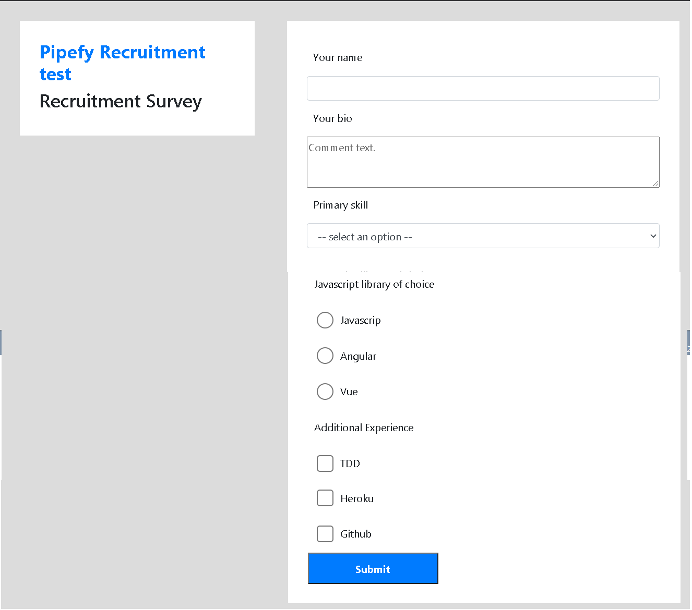

Baseado no challenge da pipefy, projeto feito em react e typescript, caso o input não seja preenchido ou escolhido
exibi uma lista vermelha indicando a falha, caso todos sejam preenchidos exibi o alerta de aprovado 

 

para instalar basta baixar as dependencias com npm install ou yarn add depois na pasta raiz yarn start

